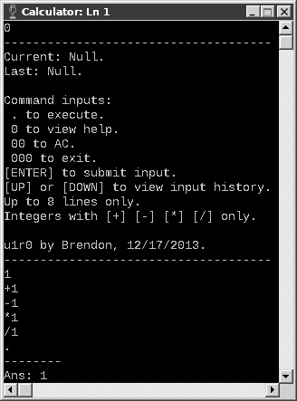
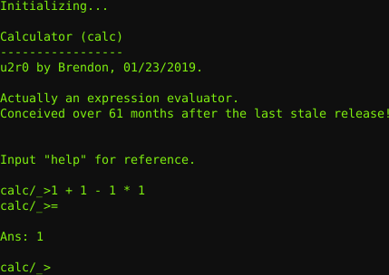
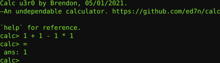

# Calc

—An undependable calculator.

## Downloads

* [[**Latest Release**](https://github.com/ed7n/calc/raw/master/src/calc.sh)] — Update 3 Revision 0, 05/01/2021.

##### Screenshot

* [[**Latest Release**](https://github.com/ed7n/calc/raw/master/res/u3r0.png)]

## Usage

`./calc.sh [<expression>]`

## About

*This project is not to be taken seriously. If you need a calculator, then
either get one for cheap, or use [[SpeedCrunch](https://speedcrunch.org)].*

Here are my ridiculous attempts to make a calculator:

The first one dates back to 2013, when I was writing only batch scripts at the
time, and my skills were infant.

The second one surfaced over 61 months later. My skills have much matured by
then.

The third and latest one is a modification of the second.

